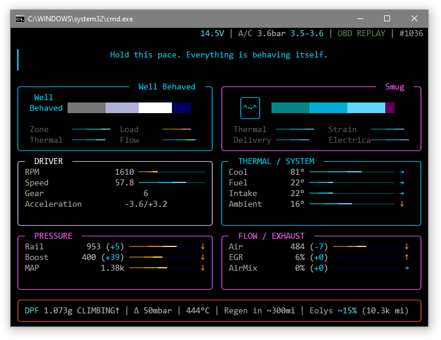
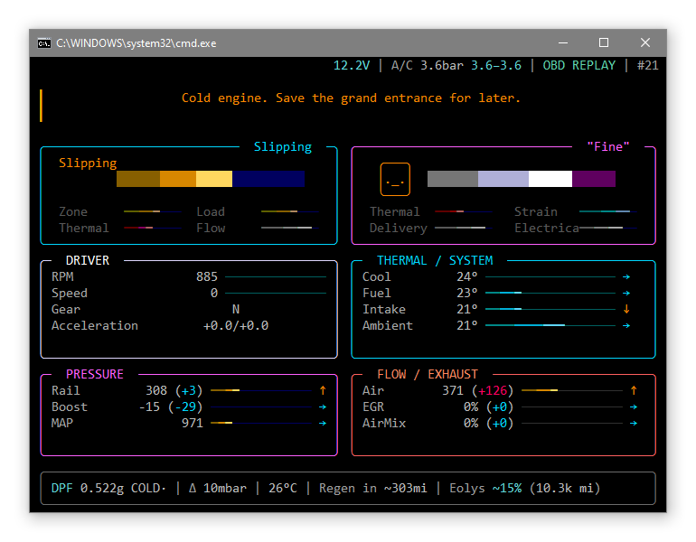
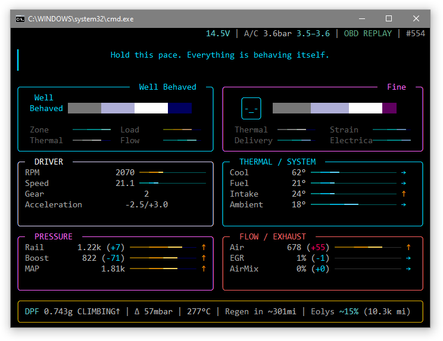
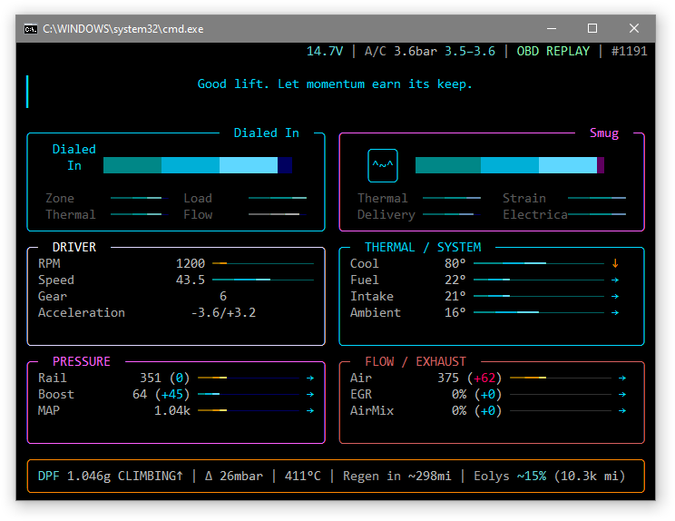
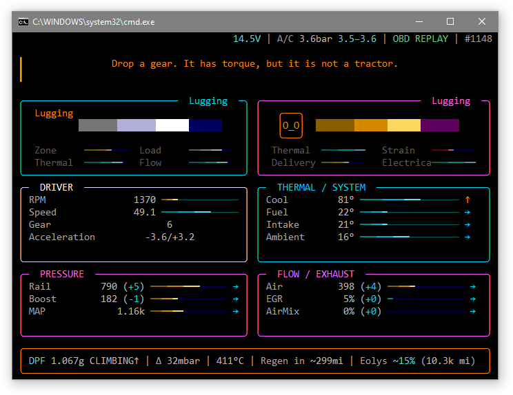

# FoxDash

FoxDash is a Raspberry Pi vehicle dashboard for live ECU telemetry, built specifically around the PSA SID807 used by the car rather than as a generic OBD-II dashboard. It reads the ECU through an ELM-compatible serial adapter, decodes the PSA-specific data used by the dashboard, and presents it through a Textual UI with optional RGBW and ambient-light hardware.

> **Status:** the software side is largely complete. The remaining work is the final enclosure, display/hardware integration, and fitting the finished unit into the car.

## Simulator

The Windows replay mode runs the same dashboard against a sanitised telemetry capture, so the UI and telemetry logic can be developed without the car attached.

<p align="center">
  
</p>

<details>
<summary>More simulator states</summary>

<p align="center">
  
  
</p>
<p align="center">
  
  
</p>

</details>

## What is here

- `foxdash_lite/` - dashboard runtime, telemetry processing, PSA SID807 decoding, logging, LEDs and ambient-light support.
- `scripts/linux/` - Raspberry Pi/Linux setup and launchers.
- `scripts/windows/` - Windows replay/simulator launchers for development without the car attached.
- `deploy/raspberry-pi/` - visible-terminal and autostart glue used on the Pi.
- `sample_data/` - a short sanitised telemetry capture for replay testing.
- `tests/` and `tools/` - unit tests, smoke tests, calibration helpers and hardware bench tools.

## Quick start

Windows replay/simulator:

```bat
scripts\windows\run_replay.bat
```

Linux replay:

```bash
./scripts/linux/run_replay.sh
```

On the Raspberry Pi, set the environment up once and then run live:

```bash
./scripts/linux/setup.sh
./scripts/linux/run_live.sh
```

Live session logs are written to `~/CarOBD/logs` by default. That data directory is intentionally not part of the repository.

## Notes

FoxDash is a personal project built around one vehicle, its PSA SID807 ECU, and its hardware setup. The code is public because the project is useful to document and develop in the open, not because it is intended to be a universal OBD dashboard package.
