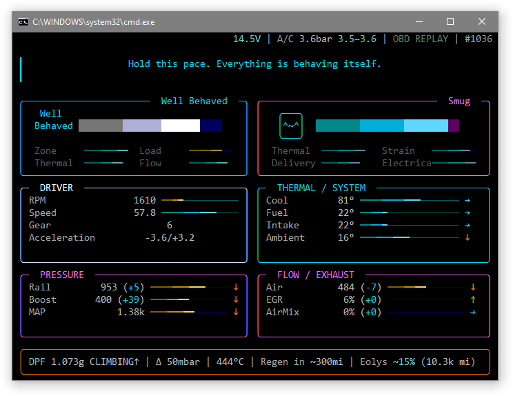
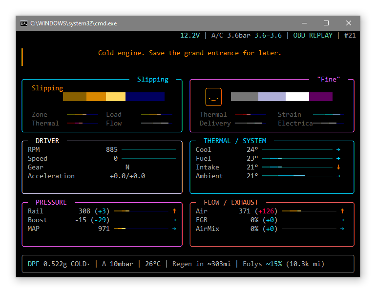
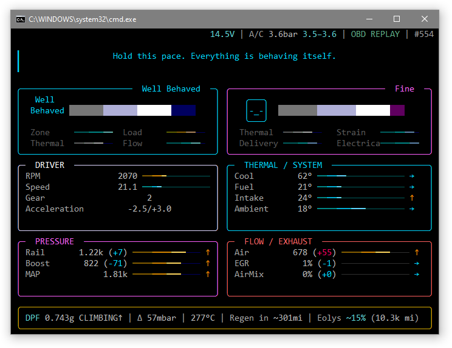
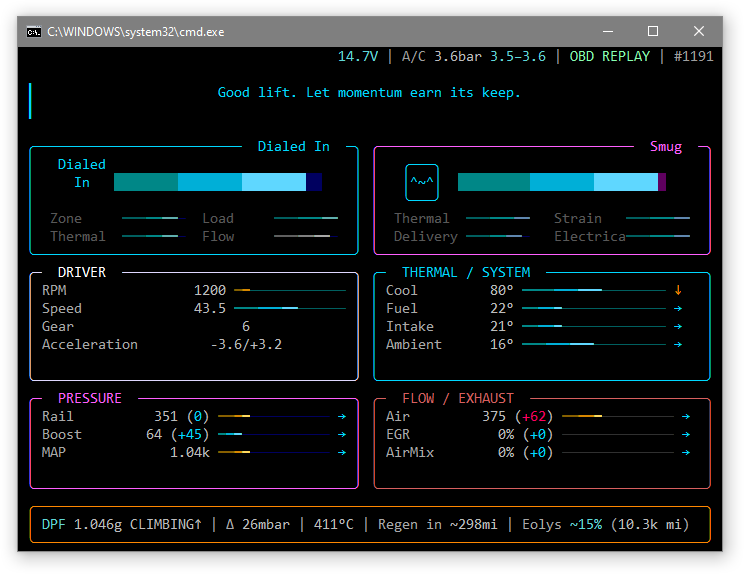
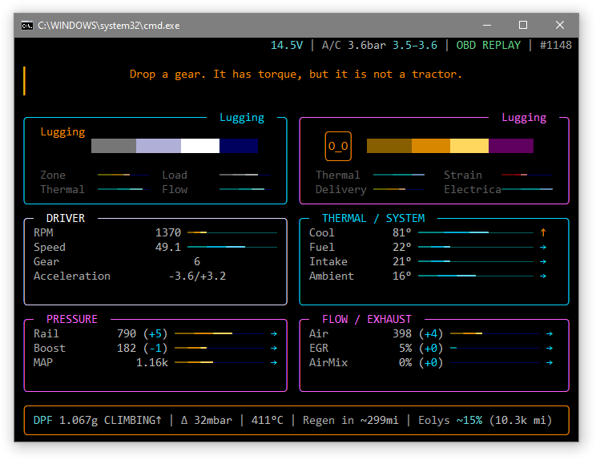

# FoxDash

FoxDash is a Raspberry Pi vehicle dashboard for live ECU telemetry, built specifically around the PSA SID807 used by the car rather than as a generic OBD-II dashboard. It reads the ECU through an ELM-compatible serial adapter, decodes the PSA-specific data used by the dashboard, and presents it through a Textual UI with optional RGBW and ambient-light hardware.

> **Status:** the software side is largely complete. The remaining work is the final enclosure, display/hardware integration, and fitting the finished unit into the car.

## Simulator

The Windows replay mode runs the same dashboard against a sanitised telemetry capture, so the UI and telemetry logic can be developed without the car attached.

<p align="center">
  
</p>

<details>
<summary>More simulator states</summary>

<p align="center">
  
  
</p>
<p align="center">
  
  
</p>

</details>

## What is here

- `foxdash_lite/` - dashboard runtime, telemetry processing, PSA SID807 decoding, logging, LEDs and ambient-light support.
- `scripts/linux/` - Raspberry Pi/Linux setup and launchers.
- `scripts/windows/` - Windows replay/simulator launchers for development without the car attached.
- `deploy/raspberry-pi/` - visible-terminal and autostart glue used on the Pi.
- `sample_data/` - a short sanitised telemetry capture for replay testing.
- `tests/` and `tools/` - unit tests, smoke tests, calibration helpers and hardware bench tools.

## Quick start

Windows replay/simulator:

```bat
scripts\windows\run_replay.bat
```

### Website media export (Windows)

Developers can record the existing replay simulator and create web-ready media with:

```powershell
.\WebsiteExport.ps1
```

FFmpeg must already be installed and available on `PATH`; the exporter never installs system software. It launches the replay in a full-colour PowerShell console, captures FoxDash's exact 800x480 client area without the title bar or borders, then creates a 1280x768 H.264 MP4 and 720x432 animated WebPs under the ignored `website-export/` directory, preserving the 5:3 aspect ratio. The default recording is 60 seconds with the replay running at 2x speed. Pass `-DurationSeconds` or `-ReplaySpeed` to change those values, and edit the readable `$WebPClips` table near the top of `WebsiteExport.ps1` to adjust clip names, start times, and durations. `WebsiteExport.bat` is provided for double-click or Command Prompt use.

Linux replay:

```bash
./scripts/linux/run_replay.sh
```

On the Raspberry Pi, set the environment up once and then run live:

```bash
./scripts/linux/setup.sh
./scripts/linux/run_live.sh
```

Live session logs are written to `~/CarOBD/logs` by default. That data directory is intentionally not part of the repository.

### Provisional linked ambient brightness (Pi)

The Pi visible dashboard launcher enables `--enable-ambient-brightness`. The BH1750 on I²C bus 11 (`0x23`) controls **dashboard palette colours AND HyperPixel PWM backlight**, using one bounded logarithmic lux factor, plus optional RGBW LED intensity. The palette and PWM share the same normalised factor: palette 1–100% maps to the experimentally usable backlight range **6–56**, not the hardware's advertised 0–255. Backlight changes are handled on a separate worker at most ~3 times per second, to avoid blocking the Textual UI on sudo/sysfs writes. The preliminary curve starts around palette 25% / PWM 18 at 0 lux and reaches palette 100% / PWM 56 at 1,000 lux. These endpoints are provisional pending mounted-car calibration.

Run `sudo ./scripts/linux/setup_backlight_control.sh` once on the HyperPixel Pi to grant only the limited passwordless backlight write permission. The ambient CSV logs (`psa_ambient_light_*.csv`) remain independent and unchanged. The UI and logs continue to work if PWM control is unavailable; the debug panel shows the error.

Press `d` to inspect raw/filtered lux and current `Brightness ... palette | PWM actual/target | AUTO`. The `[` and `]` keys override *both* the palette and the PWM together until restart (LED ambient control remains separate). Remove `--enable-ambient-brightness` from the launcher to return to the previous palette/LED behaviour, with no automatic PWM writes. Invalid or stale readings preserve the last linked brightness; no PWM adjustment is attempted until the first valid sensor reading.

## Notes

FoxDash is a personal project built around one vehicle, its PSA SID807 ECU, and its hardware setup. The code is public because the project is useful to document and develop in the open, not because it is intended to be a universal OBD dashboard package.

## Licence

FoxDash project material is licensed under the [Awoo Licence v2.0](https://awoo.ltd/licence/). Third-party components remain subject to their respective licences; see [THIRD_PARTY_NOTICES.md](THIRD_PARTY_NOTICES.md).
